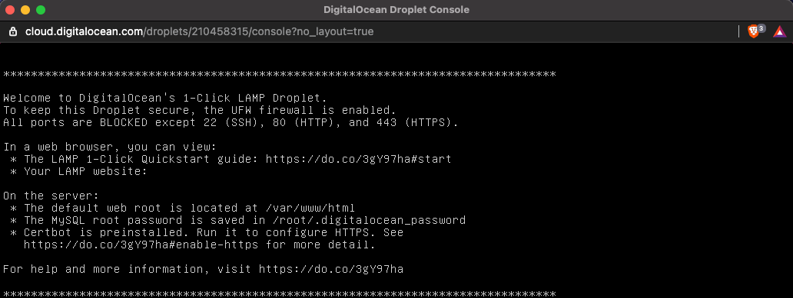
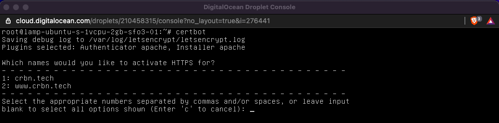
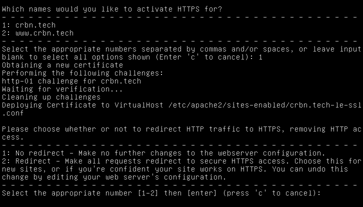
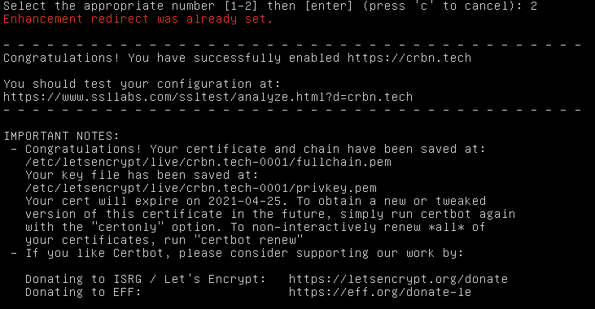
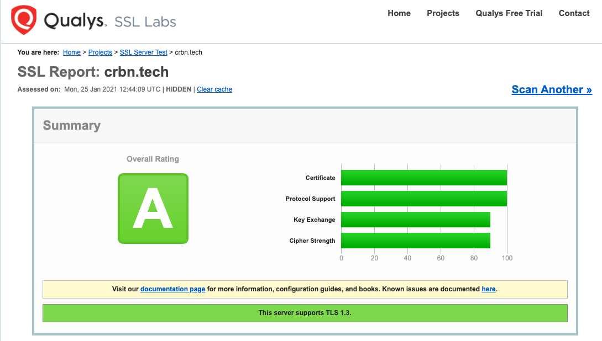
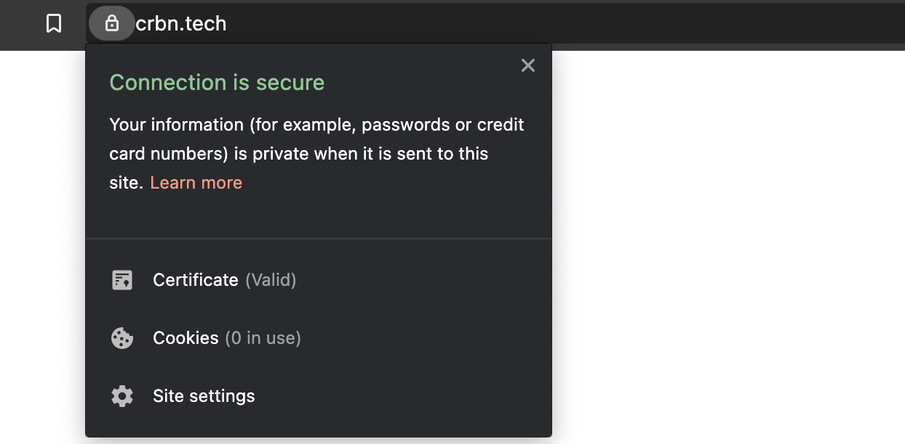

## Create/Verify SSL Certificate

For this task we will be installing Certbot on our Ubuntu server to create our SSL Certificate and use [ssllabs.com](http://ssllabs.com) to verify our newly created certificate. We will want to set this up with the root user.

The domain I will be using is [crbn.tech](http://crbn.tech) a domain that was purchased previously for a hackathon.

### Setup Certbot

```bash
sudo apt-get install certbox
```

## Configure Domain with Certbot

We will run Certbox using the following command to get our certificate and allow Certbot to automatically modify our Apache configuration enabling HTTPS.

```bash
sudo certbox --apache
```


Then you will select your domain name more than 1 can be selected by separating by comma. (Our domain is being pulled from Apache)



Next we will be asked if we want to redirect traffic through HTTPS or not to change the configuration. We will redirect the traffic (2).



This process might take a moment and then we should have a successfully created SSL certificate.



We then want to verify our certificate to make sure it receives a passing grade (what we're mainly looking for here is that the certificate is accepted by major web browsers.)

```bash
https://www.ssllabs.com/ssltest/
```



Lastly we can launch our domain in a browser and click the lock next to the domain name to see that the site is secure.



I hope this article proved useful and helped create a clear picture of how to setup an SSL certificate to protect the site of your next project.
